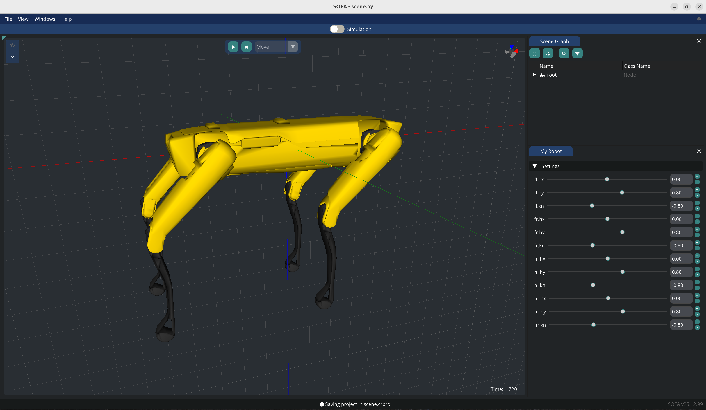

# Spot

Simulation of the Spot robot using the SoftRobots and Sofa.RigidBodyDynamics plugins for SOFA.

## Installation 

1. Clone SOFA (on the master branch): `git clone git@github.com:sofa-framework/sofa.git`
2. Compile SOFA from source following the instructions from the SOFA website: https://www.sofa-framework.org/download/. Once done test the default simulation to ensure SOFA is working correctly. In a terminal, navigate to the build directory and run: `./bin/runSofa`.
3. Clone the required plugins into a single directory e.g. `plugins`. Create the following structure:
    ```
    |-- SOFA
      |-- plugins
      |   |-- STLIB
      |   |-- SofaGLFW
      |   |-- SofaPython3
      |   |-- Sofa.RigidBodyDynamics
      |   |-- SoftRobots
      |   |-- CMakeLists.txt
      |-- build
      |-- src
    ```
    - SofaPython3:   
        `git clone git@github.com:sofa-framework/SofaPython3.git`
    - SofaGLFW (on the robotics branch):   
        `git clone git@github.com:SofaComplianceRobotics/SofaGLFW.git`  
        `git checkout robotics`
    - Sofa.RigidBodyDynamics:     
        `git clone git@github.com:olivier-roussel/Sofa.RigidBodyDynamics.git`
    - SoftRobots:  
        `git clone git@github.com:SofaDefrost/SoftRobots.git`
    - STLIB:  
        `git clone git@github.com:SofaDefrost/STLIB.git`
4. Add the plugins to SOFA by editing the `CMakeLists.txt` file in the `plugins` directory:
    ```cmake
    cmake_minimum_required(VERSION 3.10)
    sofa_add_subdirectory(plugin SofaPython3 SofaPython3 ON)
    sofa_add_subdirectory(plugin SoftRobots SoftRobots ON)
    sofa_add_subdirectory(plugin SofaGLFW SofaGLFW ON)
    sofa_add_subdirectory(plugin STLIB STLIB ON)
    sofa_add_subdirectory(plugin Sofa.RigidBodyDynamics Sofa.RigidBodyDynamics ON)
    ```
5. Add to Cmake the path to the CMakeLists.tkt file by adding the following variable: `SOFA_EXTERNAL_DIRECTORIES=PATH_TO_/plugins` 
6. Install pinocchio (to model the rigid robot):
    1. Follow installation procedure from: https://stack-of-tasks.github.io/pinocchio/download.html
    2. In CMake: `CMAKE_PREFIX_PATH = /opt/openrobots/lib/cmake/`
7. Now that the plugins have been added you can recompile SOFA.

## How to run the simulation

1. Add SOFA to your PATH. In a terminal, run:
    ```bash
    export SOFA_ROOT=PATH_TO_SOFA/build
    export PATH=$SOFA_ROOT/bin:$PATH
    export PYTHONPATH=$SOFA_ROOT/lib/python3/site-packages
    ```
2. In the same terminal, launch the simulation by running:
    ```bash
    runSofa -l SofaPython3,SofaImGui -g imgui scene.py
    ```